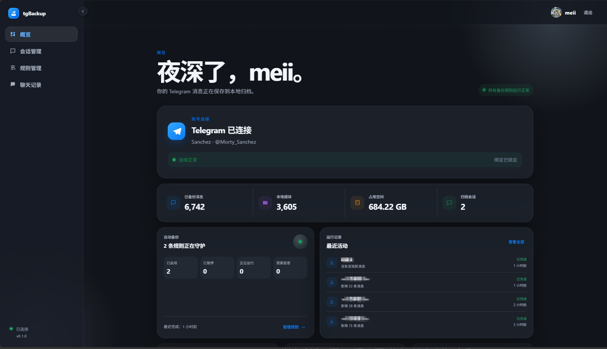
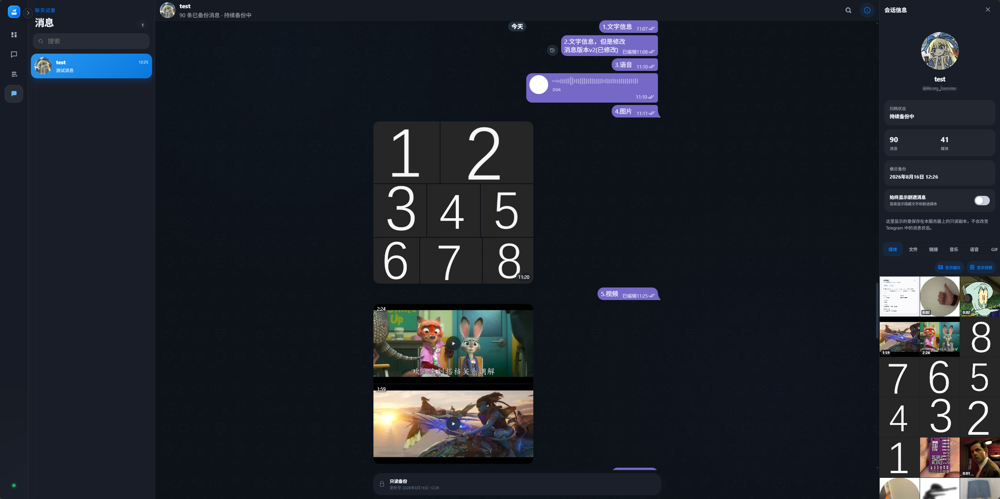

# tgBackup

tgBackup 是一个把 Telegram 聊天保存到自己电脑或服务器上的备份工具。


它能做什么？：

- 定时备份：尽可能完整地把你的 Telegram 聊天和媒体保存下来；
- 即使你以后登录不上Telegram，或者是某个聊天被删除、封锁，也能像翻聊天客户端一样查看已经备份的内容；
- 内置备份消息浏览器，UI、消息气泡、操作逻辑完全对齐Telegram官方客户端，没有额外的学习成本。




---

## 能备份什么

几乎所有telegram消息类型，目前支持保存：

- 私聊、群组、超级群组、频道和“收藏夹”；
- 消息正文、发送者、发送时间、回复关系、转发来源和编辑记录；
- 图片、视频、文件、语音、音频、动图和贴纸；
- 相册、联系人、位置、投票、骰子、服务消息等特殊内容；
- 消息的浏览量、转发数、回复数和回应等状态信息；
- 联系人、群组和频道的名称、头像及资料变化。

每个会话都可以单独设置备份规则。第一次运行会从头保存历史消息，之后只同步新增内容，不需要每次重新下载全部聊天。

如果消息后来被编辑或删除，“历史消息更新”功能可以定期检查已经归档的内容，并把这些变化记录下来。旧版本不会直接被覆盖，之后仍然可以查看。

媒体类型可以按会话选择。如果希望做尽可能完整的备份，请在规则里勾选全部媒体类型。




---

## 开始

你需要准备：

- Python 和 Node.js；
- MySQL；
- 一个 Telegram API ID 和 API Hash，可在 [my.telegram.org](https://my.telegram.org) 的 **API development tools** 中申请；
- 一台有足够磁盘空间的电脑或服务器。

媒体文件会原样保存在磁盘上。群组和频道较多时，空间占用可能很快增长，建议提前规划好数据盘和备份策略。

---

## 运行

下面以 Windows PowerShell 为例。

### 1. 下载项目并安装后端依赖

```powershell
git clone https://github.com/1105821037/tgBackup.git
cd tgBackup

python -m venv .venv
.\.venv\Scripts\python.exe -m pip install -r requirements.txt
```

Linux 上可将 Python 命令换成：

```bash
python3 -m venv .venv
./.venv/bin/python -m pip install -r requirements.txt
```

### 2. 填写配置

复制一份环境变量示例：

然后打开 `.env`，至少填写这些内容：

```env
TELEGRAM_API_ID=你的_API_ID
TELEGRAM_API_HASH=你的_API_HASH

MYSQL_HOST=127.0.0.1
MYSQL_PORT=3306
MYSQL_USER=tg_backup
MYSQL_PASSWORD=你的_MySQL_密码
MYSQL_DATABASE=tg_backup
```


### 3. 初始化数据库

确保 MySQL 已经启动，然后运行：

```powershell
.\.venv\Scripts\python.exe backend\scripts\init_database.py
```

初始化脚本会按配置创建数据库和表。

### 4. 构建网页

```powershell
cd frontend
npm ci
npm run build
cd ..
```

Vite 只在构建网页时使用。构建完成后，网页会放在 `frontend/dist`，日常运行不需要再启动 Vite。

### 5. 启动

```powershell
.\.venv\Scripts\python.exe -m uvicorn backend.app.main:app --host 127.0.0.1 --port 8000
```

打开 [http://127.0.0.1:8000](http://127.0.0.1:8000)。

第一次打开时，页面会让你创建管理员账号。进入系统后，再按提示输入手机号、验证码和 Telegram 两步验证密码完成登录。

绑定完成后，到“会话”页面选择想保存的聊天，设置执行时间和媒体类型即可开始备份。

---

## 数据保存在哪里

默认情况下：

- Telegram 登录 Session：按系统用户自动定位在 `data/accounts/user_{user_id}/`，数据库不保存文件路径
- 聊天媒体：`data/media/`
- 联系人、群组和频道头像：`data/avatars/`
- 消息、规则和运行记录：MySQL

数据库会保存消息、联系人资料和电话号码等原始内容，请把数据库本身当作敏感数据保护。

聊天媒体大致按下面的结构保存：

```text
data/media/user_<用户ID>/<会话ID>/<消息ID>/
```

只复制媒体目录并不算完整备份。迁移或做灾备时，请一起保存：

- MySQL 数据库；
- 数据存放目录 `data` ；
- 环境配置 `.env`。

## 更新项目

更新代码后，通常需要重新安装依赖并构建网页：

```powershell
git pull
.\.venv\Scripts\python.exe -m pip install -r requirements.txt

cd frontend
npm ci
npm run build
cd ..
```

然后重启后端服务。

目前项目还没有正式的数据库迁移系统。升级前建议先备份 MySQL 和 `data` 目录，并留意版本说明中是否提到数据结构变化。

## 常见问题

### Telegram 无法访问后，已经备份的消息还能看吗？

可以。归档页面读取的是本地数据。断线只会影响新消息同步和需要临时访问 Telegram 的功能。

### 备份后，某个历史消息被修改、删除会怎样？

开启“历史消息更新”后，系统会定期重新检查已经归档的消息。发现编辑时会增加新版本，发现删除时会记录删除状态。

### 如何删除已同步内容？

我们暂不支持单独删除某个聊天的消息，如果你需要清除所有数据重新开始，
下面的命令会重建数据库，已有数据库内容会被删除，只适合确认不再需要旧数据时使用：

```powershell
.\.venv\Scripts\python.exe backend\scripts\init_database.py --reset
```

媒体和 Session 文件是否保留，需要再根据自己的需求手动处理。执行前务必做好备份。
